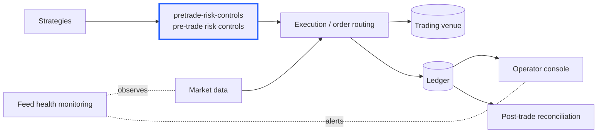
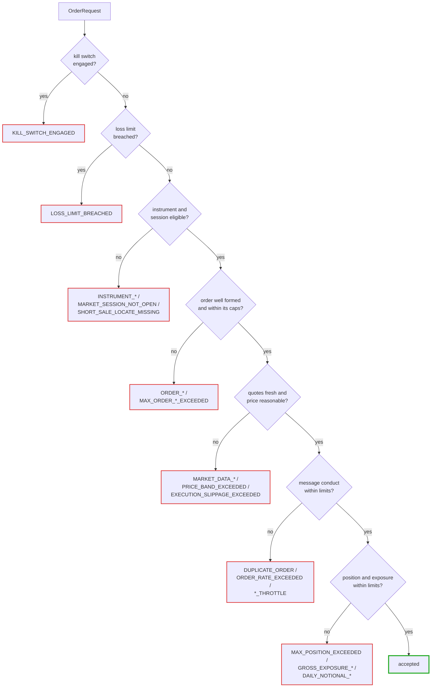
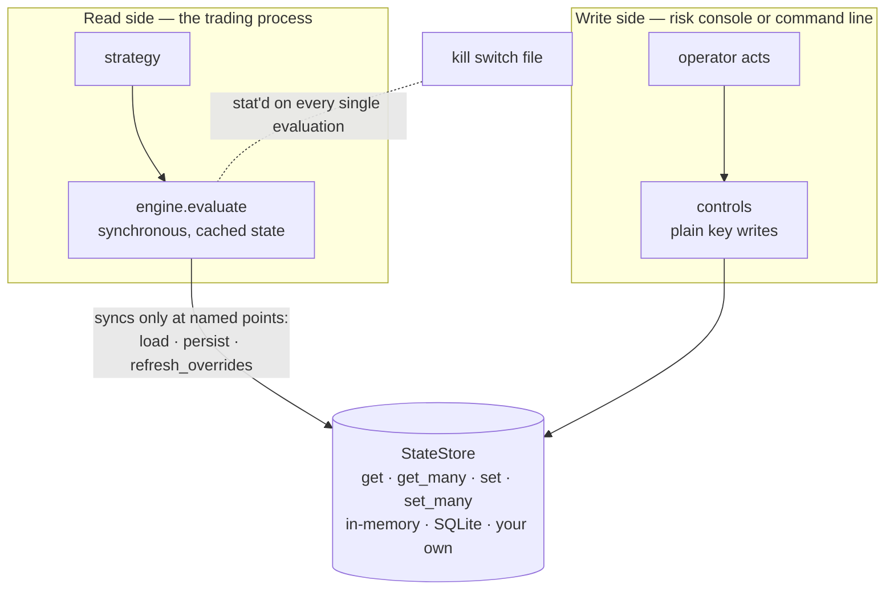

# pretrade-risk-controls

A venue-independent **pre-trade risk control layer**. Every order answers one
question before it leaves the building:

```python
decision = engine.evaluate(order)
```

An accepted decision means send it. A rejected one carries a stable reject
code, the limit that applied, and the value that breached it.

Zero runtime dependencies; Python 3.11+.

## What it checks

Twenty-four controls, in the order every order walks them. The first one to
object wins, and its code goes back to the caller.

| # | Control | Rejects when | Code |
|---|---|---|---|
| 1 | Kill switch | the kill file exists — outranks everything, including an active bypass | `KILL_SWITCH_ENGAGED` |
| 2 | Daily loss limit | realized P&L has drawn down to the trailing floor | `LOSS_LIMIT_BREACHED` |
| 3 | Instrument universe | the instrument is outside the permitted set | `INSTRUMENT_NOT_PERMITTED` |
| 4 | Restricted list | the instrument is restricted — blackout, information barrier | `INSTRUMENT_RESTRICTED` |
| 5 | Session state | the venue phase does not permit order entry | `MARKET_SESSION_NOT_OPEN` |
| 6 | Short sale locate | a short sale carries no secured borrow | `SHORT_SALE_LOCATE_MISSING` |
| 7 | Order quantity | quantity is zero or negative | `ORDER_QUANTITY_NOT_POSITIVE` |
| 8 | Order price | a limit price is zero or negative | `ORDER_PRICE_NOT_POSITIVE` |
| 9 | Order notional | the priced notional is zero or negative | `ORDER_NOTIONAL_NOT_POSITIVE` |
| 10 | Maximum order quantity | the clip is larger than any single order should be | `MAX_ORDER_QUANTITY_EXCEEDED` |
| 11 | Maximum order notional | the clip is worth more than any single order should be | `MAX_ORDER_NOTIONAL_EXCEEDED` |
| 12 | Quote age | the quotes the price controls depend on are stale | `MARKET_DATA_STALE` |
| 13 | Price band | the limit price is too far from the reference, either way | `PRICE_BAND_EXCEEDED` |
| 14 | Execution slippage | the market has moved against the decision price | `EXECUTION_SLIPPAGE_EXCEEDED` |
| 15 | Duplicate order | an identical order went out moments ago | `DUPLICATE_ORDER` |
| 16 | Order rate | too many orders inside the trailing window | `ORDER_RATE_EXCEEDED` |
| 17 | Consecutive rejections | the venue keeps refusing and the strategy keeps trying | `CONSECUTIVE_REJECT_LIMIT_EXCEEDED` |
| 18 | Repeated execution throttle | the strategy has traded N times without a human looking at it | `REPEATED_EXECUTION_THROTTLE` |
| 19 | Working orders | too many orders already live at the venue | `MAX_WORKING_ORDERS_EXCEEDED` |
| 20 | Open positions | too many instruments already held | `MAX_OPEN_POSITIONS_EXCEEDED` |
| 21 | Position limit | the order would push the instrument outside its position limit | `MAX_POSITION_EXCEEDED` |
| 22 | Self-match prevention | the firm's own quantity rests on the other side | `SELF_MATCH_PREVENTED` |
| 23 | Gross exposure | portfolio gross exposure would exceed its limit | `GROSS_EXPOSURE_LIMIT_EXCEEDED` |
| 24 | Daily notional limit | the day's cumulative notional would exceed its limit | `DAILY_NOTIONAL_LIMIT_EXCEEDED` |

Plus `MARKET_DATA_UNAVAILABLE`, which any armed price control returns when the
data it needs did not arrive — see *Fail-closed inputs* below.

### Turning controls on and off

A control runs when it is **configured and not disabled**. Two switches, on
purpose.

**Configure it** by setting its limit. Every limit defaults to unset, and
unset means the control does not run — there are no implicit defaults, because
a default limit is a limit nobody chose.

**Disable it** by naming it in `disabled_controls`, which stands the control
down *without discarding its calibration*:

```python
from pretrade_risk import ControlId, RiskLimits

limits = RiskLimits(daily_loss_limit_usd=500.0, price_band_fraction=0.03)

paused = limits.disable(ControlId.PRICE_BAND)  # limit stays at 0.03
restored = paused.enable(ControlId.PRICE_BAND)  # no need to re-derive it
```

Blanking a limit to switch something off throws away a number somebody chose
deliberately, and whoever turns it back on has to derive it again — which is
how a limit comes back wrong. Disabling by `ControlId` rather than by string
means a typo is a startup error, not a control that silently never runs.

Two guardrails. The well-formedness controls (`ORDER_QUANTITY`,
`ORDER_PRICE`, `ORDER_NOTIONAL`) cannot be disabled — a negative quantity is
malformed whatever a desk's risk appetite is. Everything else can, including
the kill switch, because a desk that manages one elsewhere needs to say so.

Ask the engine what is actually live rather than reading the configuration:

```python
>>> engine.running_controls()          # what will evaluate the next order
(<ControlId.DAILY_LOSS_LIMIT: ...>, <ControlId.ORDER_QUANTITY: ...>, ...)

>>> engine.disabled_controls()         # configured, then deliberately stood down
(<ControlId.PRICE_BAND: ...>,)

>>> for status in engine.control_status():
...     print(status)
kill switch: no limit configured
daily loss limit: running
price band: DISABLED
...
```

`control_status()` separates the two reasons a control is silent — nobody set
a limit, or somebody switched it off. Those are different situations with
different owners, and a supervisor only asks about the second.

---

## Getting it

This is source you clone. It is not published to any package index, and the
commands below are the only supported way in.

```bash
git clone https://github.com/zayansalman/pretrade-risk-controls
cd pretrade-risk-controls

pip install -e .            # core: standard library only
pip install -e ".[sqlite]"  # adds the SQLite-backed store (aiosqlite)
pip install -e ".[dev]"     # adds pytest and ruff
```

```python
from pretrade_risk import PreTradeRiskEngine, RiskLimits, OrderRequest
```

The repository is `pretrade-risk-controls`; the import package is
`pretrade_risk`, kept shorter because it appears at the head of every import
line. Vendoring the `src/pretrade_risk` directory straight into your own tree
works too — there is nothing to resolve.

> **Venue-independent means venue-independent.** There is no venue client
> here, no assumption about how prices are bounded, no instrument-type
> arithmetic. The engine takes an order plus some context and returns a
> decision. It was built against a prediction-market desk and applies
> unchanged to equities, futures or FX.

---

## The modules, in plain English

Eleven small modules. Each one does a single thing, and the boundaries between
them are the seams you would swap when porting or embedding this.

| Module | What it is |
|---|---|
| **`engine.py`** | The risk engine. Holds the limits and the day's counters, and runs every order through the controls in a fixed order. This is the module you call. |
| **`limits.py`** | The limit set — one field per control, plus the `disable`/`enable` switch. Anything left unset means that control does not run. This is what a desk configures. |
| **`order.py`** | The order being checked, plus the context the controls need: the touch, the session phase, the current position, how many orders are already working. |
| **`decision.py`** | The stable public identifiers — `ControlId` and `RejectCode` — and the answer itself: which control fired, the limit, the observed value, and a sentence for the operator. |
| **`controls.py`** | The operator control plane — suspend a limit, resize a cap, re-arm after a halt. Writes the store; never touches a running engine. |
| **`store.py`** | The persistence contract: get, get many, set, set many, over strings. A dictionary satisfies it; so does a database. |
| **`sqlite_store.py`** | A SQLite implementation of that contract, with atomic batch writes. The only module with a third-party import. |
| **`keys.py`** | The list of every key written to the store, and what each one holds. |
| **`clock.py`** | Time, as an injected dependency, plus the trading-day calculation. Lets tests drive time-based controls exactly, and keeps the day boundary off UTC midnight where a venue needs it. |
| **`encoding.py`** | How numbers are written to and read from the store, specified explicitly rather than inherited from Python. |
| **`windows.py`** | The trailing-window counters behind the duplicate and message-rate controls. |

Read them in that order and the library makes sense end to end.

---

## Does this cover what a trading desk needs?

Partly, and the honest answer is worth more than a longer feature list. A
desk's pre-trade obligations are layered across the strategy, the order
management system, the executing broker, the venue's own risk gateway and the
clearing member. This library is one layer of that stack — the one that sits
between a strategy and the order it wants to send — and it should not pretend
to be the others.

**Covered here.** Order validation and fat-finger caps, price reasonableness,
message conduct (duplicates, rate, repeated execution), position and exposure
limits, instrument eligibility and restricted lists, session state, short-sale
locate, capital preservation via a trailing loss limit and a daily notional
budget, a kill switch, and bounded, attributed operator overrides. These map
onto the pre-trade controls named in the market access and algorithmic trading
rulebooks — maximum order value and volume, price collars, maximum message
limits, repeated automated execution throttles, kill functionality, erroneous
and duplicative order prevention, and restricted-security checks.

**Covered here, but only as good as what you supply.** Position, working
orders, gross exposure, session phase, quote age, locate status and the firm's
own resting quantity all arrive on the request. The library checks them; your
order management system is authoritative for them. It keeps no shadow copy of
your book on purpose — a risk control that disagrees with the book of record
is worse than no control.

**Deliberately elsewhere.** These belong to other layers, and a venue-neutral
library with no market data feed, no reference data and no clearing connection
cannot do them honestly:

| Not here | Where it belongs |
|---|---|
| Credit, margin and buying-power checks | clearing broker or the venue's own risk gateway, which know the account |
| Regulatory position limits and accountability levels | compliance system with contract reference data |
| Participation caps as a share of average daily volume | anything with market data history |
| Price bands, limit up / limit down, trading halts | the venue — feed the outcome in as `session_state` |
| Cancel on disconnect, cancel on kill | the session layer that owns the venue connection |
| Drop copy, post-trade surveillance, wash-trade detection | post-trade systems |
| Order tagging: algorithm IDs, short codes, legal entity identifiers, trading capacity | the order management system that builds the outbound message |
| Clock synchronisation to a traceable source | infrastructure |
| Sanctions and client screening | onboarding |
| Best execution analysis | post-trade |
| Four- and six-eye approval workflow for limit changes | the console that calls this library's control plane |

Treat the middle table as the integration checklist and the right-hand column
as the map of what still needs an owner.

**Where the control set comes from.** The list above is not invented. It is
the intersection of what the following require or recommend and what a
venue-independent library can honestly do:

- **SEC Rule 15c3-5**, the market access rule. Paragraph (c)(1) requires
  controls that prevent erroneous orders "by rejecting orders that exceed
  appropriate price or size parameters, on an order-by-order basis or over a
  short period of time, or that indicate duplicative orders" — the order size
  caps, the price band and the duplicate control. Paragraph (c)(2) requires
  preventing orders in securities the firm or customer is restricted from
  trading — the restricted list.
- **MiFID II RTS 6** (Commission Delegated Regulation (EU) 2017/589),
  Article 15, which names five pre-trade controls: price collars, maximum
  order values, maximum order volumes, maximum message limits, and repeated
  automated execution throttles. Article 12 covers kill functionality.
- **FIA and the FIA Principal Traders Group** guidance on automated trading
  systems, whose recommended controls include message and execution throttles,
  price collars, maximum order sizes, maximum intraday positions, limits on an
  order's deviation from a reference price, limits on how many times an
  algorithm may re-enter the market without human intervention, and order
  cancellation capability.
- **Reg SHO** for the short-sale locate requirement.

The gaps in the third table are gaps in what a library at this layer can see,
not gaps in the standards.

---

## Quickstart

```python
import asyncio

from pretrade_risk import (
    InMemoryStateStore,
    OrderRequest,
    PreTradeRiskEngine,
    RiskLimits,
    SessionState,
    Side,
)


async def main():
    limits = RiskLimits(
        daily_loss_limit_usd=500.0,  # trailing drawdown from the session peak
        daily_notional_limit_usd=50_000.0,  # cumulative notional for the day
        max_order_quantity=1_000.0,
        max_order_notional_usd=10_000.0,
        price_band_fraction=0.03,  # 3% either side of the reference
        max_execution_slippage=0.05,  # adverse drift from the decision price
        max_quote_age_millis=1_000,
        duplicate_window_millis=5_000,
        max_orders_per_window=20,
        max_position_quantity=2_000.0,
        tradeable_session_states=frozenset({SessionState.OPEN}),
        kill_switch_path=None,  # a Path blocks everything while it exists
    )
    engine = PreTradeRiskEngine(limits, InMemoryStateStore(), is_live=True)
    await engine.load()  # rebuild today's counters
    await engine.refresh_overrides()

    order = OrderRequest(
        symbol="ACME",
        side=Side.BUY,
        quantity=100.0,
        limit_price=10.00,
        decision_price=10.00,
        best_bid=9.99,
        best_ask=10.01,
        quote_age_millis=20,
        session_state=SessionState.OPEN,
    )

    decision = engine.evaluate(order)
    if decision:
        # ... send the order, then tell the engine what you did
        engine.record_order_sent(order)  # feeds the rate and duplicate windows
        notional = order.notional_usd()  # None only if the order cannot be priced
        if notional is not None:
            await engine.record_notional(notional)
    else:
        print(decision.code.value, decision.message)

    await engine.record_execution()  # a fill
    await engine.record_realized_pnl(-125.0, is_live=True)  # a close


asyncio.run(main())
```

Run the narrated walkthrough of a full session: `python examples/demo.py`.

---

## Where it fits



Note where the venue sits: two hops away. This library never talks to it —
the execution layer does, and that is what keeps the controls venue-neutral.

Standalone components extracted from the same trading system:
`pretrade-risk-controls` — this repository,
[ledger-recon](https://github.com/zayansalman/ledger-recon) (post-trade
reconciliation),
[feedwatch](https://github.com/zayansalman/feedwatch) (feed health and
incidents), and
[botdeck](https://github.com/zayansalman/botdeck) (operator console).

---

## The decision path



The ordering is not arbitrary. Absolute stops come first — a kill switch and a
breached loss limit end the conversation whatever the order says. Eligibility
follows, because an instrument the desk may not trade is settled without
pricing anything. Then the order's own well-formedness, then the price
controls that depend on it, then message conduct, and last the position and
exposure controls, which need the caller's book context. Cheapest and most
absolute first; most contextual last.

The sequence lives in `CONTROL_SEQUENCE` as data rather than as a chain of
`if` statements, so it can be read, tested and copied verbatim by a port.

---

## Read side, write side



`evaluate()` is synchronous and reads only cached state, so no store round
trip sits on the order path. The engine synchronises at points the caller
chooses, which leaves the caller deciding how stale an override may be. The
kill switch is the one deliberate exception: it stats its file on every
evaluation, because a control that only takes effect after a refresh has run
is not a kill switch.

The control plane and the engine never share an object. The store is the only
channel between them.

---

## Design decisions

**A trailing limit, not a fixed floor.** The loss limit fires when the mode's
realized P&L draws down to `peak − limit`. Banked gains are protected: after a
session that reached +800 with a 500 limit, the halt sits at +300, not at
−500. A session that was never profitable keeps `peak = 0`, so the floor
degrades exactly to a plain `−limit` — the equivalence is pinned by a test.

**Live and simulated share one path.** Both run the same `evaluate`, because
a simulation permitted things live would refuse is not a preview of anything.
But the loss limit reads its own leg: simulated losses never halt the live
book, and live losses never halt a simulation.

**Fail-closed inputs.** An armed control that cannot be evaluated rejects. If
a price band is configured and no reference price arrives, the answer is
`MARKET_DATA_UNAVAILABLE`, not a quiet pass. The alternative is the failure
where a desk believes it is protected by a control that stopped firing months
ago when its input stopped arriving. If a control should not apply, leave its
limit unset — do not starve it of data.

**No implicit limits.** Every limit defaults to unset, and unset means off.
A default limit is a limit nobody chose, and a risk limit nobody chose is one
nobody owns. Configuring the field is the act of turning the control on.

**Bypasses expire.** The control plane will not write a suspension without a
duration, an authoriser and a reason. An expiring bypass fails in the safe
direction: if the operator is unreachable and the console is down, the limit
re-arms itself. Turning it back on requires no action; leaving it off does.

**A position limit never traps a position.** If the book is already outside a
limit — it was lowered, an unexpected fill landed — an order that strictly
reduces the position without flipping its sign is still permitted. A position
limit must never be the reason a desk cannot trade out of the position that is
breaching it.

**The trading day is not the calendar day.** Futures sessions roll in the
evening of the preceding date. `session_roll_millis` puts the counter boundary
where the venue puts it, so the day's loss limit does not reset in the middle
of a live evening session. Left at zero, it is a plain UTC day.

**Throttle counters survive a restart; message windows do not.** A
crash-restart loop must not earn itself a fresh allowance of rejections, so
the reject and execution counts are persisted. The rate and duplicate windows
describe what a live session has just sent, and a process that restarted has
sent nothing — reloading a stale burst would reject the first legitimate
orders of the new session.

**Fail-safe defaults everywhere.** Absent or damaged state always degrades
toward more protection: a missing high water mark derives as `max(0, pnl)`, a
non-numeric override reads as unset, a bypass flag with no expiry reads as
inactive, a stale trading date starts the day fresh.

---

## Operator control plane

Free functions over a bare store handle, callable from a process that holds no
engine at all:

```python
from pretrade_risk import (
    bypass_loss_limit,
    clear_loss_limit_bypass,
    read_loss_limit_bypass,
    reset_daily_loss_limit,
    set_runtime_max_order_notional,
)

# Suspend the loss limit — bounded, attributed, and self-reversing.
await bypass_loss_limit(
    store,
    duration_millis=15 * 60_000,
    actor="risk.manager",
    reason="unwinding an illiquid position after the halt",
)

record = await read_loss_limit_bypass(store)  # who, why, when, until

await set_runtime_max_order_notional(store, 2_500.0)  # resize without a restart
await clear_loss_limit_bypass(store, actor="risk.manager")
await reset_daily_loss_limit(store)  # stopped engines only — see the docstring
```

Every change takes effect on the engine's next `refresh_overrides()`.

---

## Porting to another language

Python is not the usual choice for this layer, and the library is written so a
port is a transcription rather than a redesign. The conventions that make that
true:

**Numbers.** All monetary and quantity arithmetic is IEEE-754 binary64, which
every target language has. Comparisons against limits are inclusive at the
boundary (`<=` passes) and that is asserted by tests, so a port can reproduce
the boundary exactly. If you move to a decimal or fixed-point currency type,
keep the same comparison direction.

**Persisted values.** Floats are written with 17 significant digits (`%.17g`),
the shortest fixed precision that round-trips a binary64 exactly and the one
format every C-style `printf` renders identically. Language-default float
formatting does not agree across languages and must not be used here.

**Parsing.** The accepted number grammar is stated explicitly in
`encoding.py` and enforced with a regular expression, because host float
parsers are more permissive than the format and disagree with each other —
Python's `float()` takes `nan`, `infinity` and `1_0`; C's `strtod` also takes
hex floats. Two details a port must copy: match ASCII `[0-9]` rather than
`\d`, and anchor with `\A`/`\Z` rather than `^`/`$`, since `$` also matches
before a trailing newline.

**Time.** Whole milliseconds since the UNIX epoch, as an integer, through an
injected clock. No language-specific date type crosses a seam. The trading-day
calculation needs only integer arithmetic and a UTC epoch-to-date conversion —
no timezone database.

**The store.** Four methods over strings: `get`, `get_many`, `set`,
`set_many`. Batching is part of the interface rather than a capability to
sniff for at runtime, so a port has one interface to implement and a backend
that can commit atomically simply does.

**Reject codes.** Stable `UPPER_SNAKE_CASE` string values, not enum ordinals
and not prose. The message wording may change in any release; the code may
not. Route on the code.

**Control order.** `CONTROL_SEQUENCE` is an array of `(name, is-armed,
check)`. Copy the array; do not re-derive the order from control flow.

**Structure.** The decision path is synchronous and allocation-light, and only
the persistence seam is asynchronous — so a port can make the store blocking,
callback-based or coroutine-based to suit its runtime without touching the
controls. Nothing on the decision path raises; rejections are return values.
Configuration errors raise, and they raise at construction, not at the first
order of the day.

---

## Limitations

Read these before trusting it with money.

- **One engine, one book, one store namespace.** No cross-instrument netting
  beyond the gross exposure figure you supply. Wrap the store with a key
  prefix to run several engines against one backend.
- **It does not keep your positions.** Position, working orders and exposure
  arrive on each request. If the caller supplies stale values, the controls
  that read them are stale too.
- **Market orders are not collared.** A market order carries no price to band
  check, so it is constrained only by the quantity and notional caps and by
  the venue's own bands. A caller that routes around the price band by sending
  market orders will succeed.
- **The loss limit is realized P&L only.** Open positions are not marked to
  market, so an unrealized drawdown does not halt anything until it is closed.
- **Message windows are per process.** Two processes sharing a store do not
  share a rate limit; the venue sees their sum.
- **The engine's own limits are not the venue's.** Nothing here replaces the
  broker's or the venue's own pre-trade risk gateway, and nothing here is a
  substitute for the credit and capital controls that layer owns.

---

## Naming

The industry term for this component is *pre-trade risk controls*, and
exchanges and vendors ship it under the name *Pre-Trade Risk Management*
(PTRM) — Nasdaq, HKEX and Borsa İstanbul all title their systems exactly that,
and MiFID II RTS 6 calls the checks themselves "pre-trade controls".

This project was previously called `pretrade-gate`. "Pre-trade" was already
the standard term, but "gate" was the colloquial half: a desk says controls,
checks or gateway, and in real documentation "gateway" names the interface a
participant connects to rather than the check it performs — Nasdaq's
participant-facing component is the "PTRM Gateway", and Exegy sells "market
access gateways". A repository called `pretrade-gate` reads, to someone in the
field, like connectivity rather than risk logic.

So the repository is `pretrade-risk-controls` — the industry's own phrase for
what this is, and the term someone would search for.

**The import package stays shorter: `pretrade_risk`.** The repository name has
to say what the thing is to somebody who has never seen it; an import line
only has to be unambiguous inside a file that already imports it. Spending the
full name at the head of every module would restate what the surrounding code
makes obvious.

Persisted state lives under `pretrade.*`.

---

## Provenance

This began as the risk layer of a live automated trading system running on
Polymarket, where an earlier version of the trailing loss limit, the kill
switch and the persisted daily counters sat in front of every order. That
system's lesson is the one written through this library: every default starts
with the control armed. When its loss-limit bypass was widened from
simulation-only to both modes, a flag left on by an old simulation run would
have silently disarmed the limit on the live book. That is why bypasses here
cannot be written without an expiry.

The extraction replaced a hard-wired configuration table with the injected
store. The rework since then generalised a single-instrument,
one-position-at-a-time check into the control set above — and in doing so
removed the last venue-specific assumption in the code, a share-denominated
order cap that relied on binary-contract prices being below 1. Order size is
now quantity and notional, checked independently, the way every other market
expresses it.

MIT licensed.
