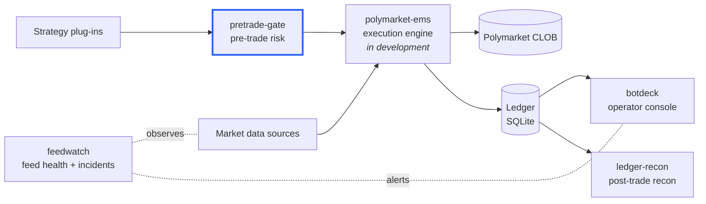
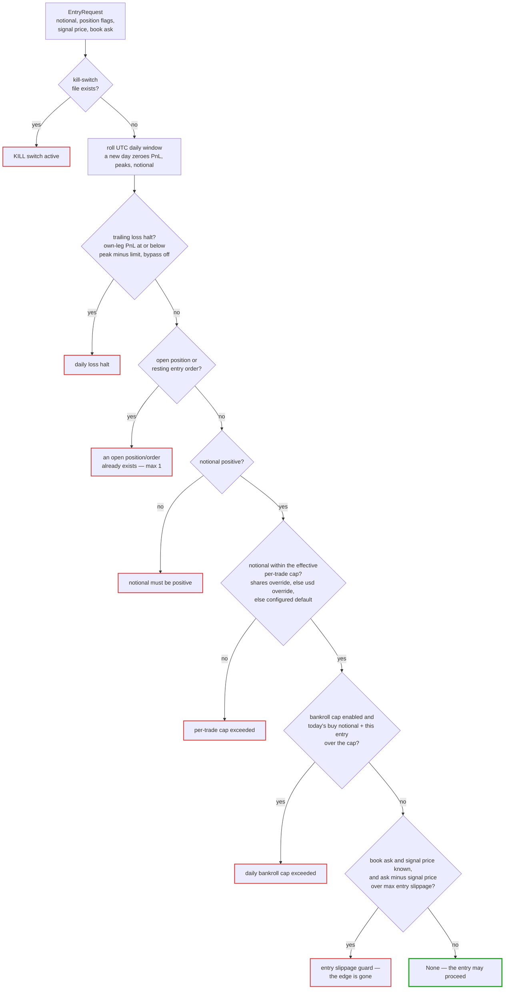
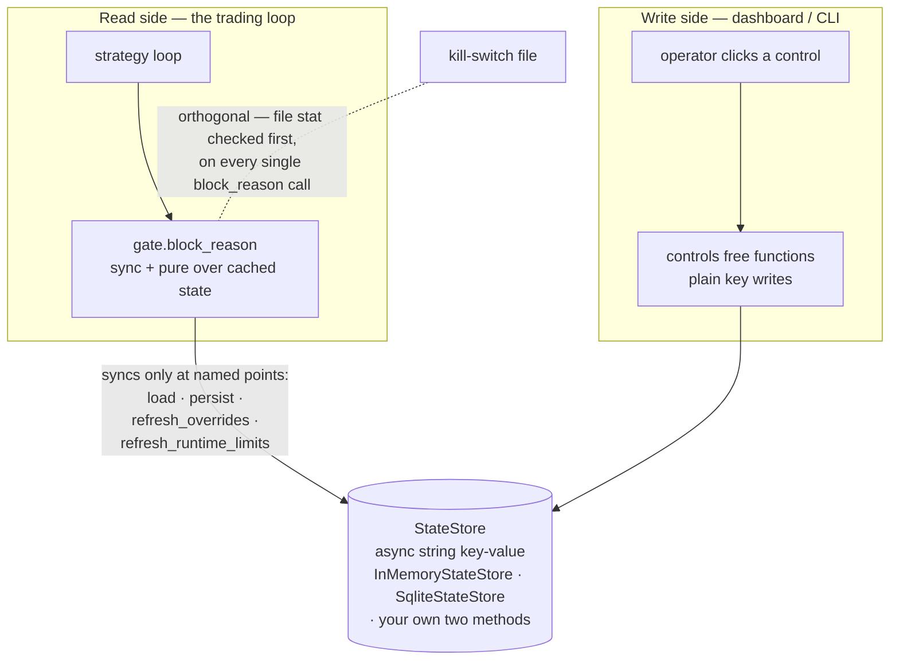

# pretrade-gate

Every order your bot wants to place answers one question first:
`gate.block_reason(request)` — `None` means trade; a string tells the operator
exactly why not.

A venue-independent pre-trade risk gate with a **trailing daily-loss halt**,
persisted daily counters, a file-based kill switch, and an operator control
plane — extracted from a real-money automated trading system. Zero runtime
dependencies; Python 3.11+.

```bash
pip install -e .            # core: stdlib only
pip install -e ".[sqlite]"  # adds the SQLite-backed store (aiosqlite)
```

## Where it fits



Standalone siblings extracted from the same trading system:
[pretrade-gate](https://github.com/zayansalman/pretrade-gate) — this repo,
[ledger-recon](https://github.com/zayansalman/ledger-recon),
[feedwatch](https://github.com/zayansalman/feedwatch), and
[botdeck](https://github.com/zayansalman/botdeck).

## Quickstart

```python
import asyncio
from pretrade_gate import EntryRequest, GateConfig, InMemoryStateStore, RiskGate


async def main():
    cfg = GateConfig(
        max_trade_usd=25.0,  # per-trade clip cap
        daily_loss_halt_usd=50.0,  # trailing drawdown limit from the session peak
        bankroll_cap_usd=200.0,  # cumulative daily BUY notional cap (None = off)
        max_entry_slippage=0.02,  # max ask drift vs the signal price
        kill_switch_path=None,  # a Path blocks everything while the file exists
    )
    gate = RiskGate(cfg, InMemoryStateStore(), is_live=True)
    await gate.load()  # rebuild today's counters from the store

    req = EntryRequest(
        notional_usd=20.0,
        position_open=False,
        entry_order_resting=False,
        side_price=0.55,
        best_ask=0.56,
    )
    reason = gate.block_reason(req)
    print("trade" if reason is None else f"blocked: {reason}")

    await gate.record_realized_pnl(-12.5, is_live=True)  # closes feed the halt
    await gate.record_buy_notional(20.0)  # entries feed the bankroll cap


asyncio.run(main())
```

Run the full narrated walkthrough: `python examples/demo.py`.

## What it protects against

| # | Gate | Protects against |
|---|------|------------------|
| 1 | Kill switch (file) | anything — one `touch KILL` halts every entry, bypass included |
| 2 | Trailing daily-loss halt | bleeding banked gains back; a losing day past the limit |
| 3 | One-position rule | stacking entries / doubling into an unfilled resting order |
| 4 | Positive-notional check | sign bugs and zero-size orders reaching the venue |
| 5 | Per-trade cap (+ runtime overrides) | fat-finger sizing; resizing the clip needs no restart |
| 6 | Daily bankroll cap | a runaway loop spending the whole bankroll in one day |
| 7 | Entry slippage guard | paying a price the signal never saw (the edge is gone) |
| 8 | Persisted counters | a restart quietly resetting the halt or re-granting bankroll |

## The decision path

Every entry — paper or live — walks the same sequence inside
`RiskGate.block_reason()`. The first tripped gate wins: its reason string goes
back to the caller verbatim and becomes the operator's log line. `None` is the
only green light.



This is the code's actual check order (the same order as the table above,
rows 1–7). The loss-halt bypass is consulted inside the halt check only — a
bypassed halt still leaves every other gate armed, and the kill switch
outranks the bypass.

## Architecture: read side vs write side



`block_reason()` is synchronous and pure over cached state — no store I/O on
the hot path (the kill-switch file stat is the one deliberate exception: a
safety check must not depend on a refresh having run).
The gate syncs with the store only at the named points above, so the
loop decides when staleness is acceptable (in production: `refresh_*` every
tick, `persist` on every counter change). The control plane and the gate never
share an object; the store is the only channel between them.

## Design decisions

**Trailing high-water mark, not a fixed floor.** The halt fires when the
mode's own realized PnL draws down to `peak − limit`. Banked gains are locked:
after a +$30 run with a $10 limit you can give back $10, not $40. A
never-profitable session keeps `peak = 0`, so the floor degrades EXACTLY to
the old fixed `−limit` behaviour — this equivalence is pinned by a test.

**Live/paper split, one code path.** Paper must preview live faithfully, so
both modes run the SAME `block_reason` — drift between them is the bug the
unified gate exists to prevent. But the halt reads the mode's OWN PnL leg:
paper study losses never halt real money, and vice versa.

**Reset clears peaks, not just PnL.** Zeroing PnL alone cannot clear a
trailing halt: with a banked +$30 peak the floor sits at +$20, so PnL 0 is
still below it and you stay halted. `reset_daily_loss_halt` therefore zeroes
both legs' PnL *and* both peaks, and deliberately leaves the date and the
bankroll-cap notional alone.

**An injected string key-value store.** The gate persists through two async
methods (`get`/`set` of strings). That makes the persistence seam trivially
swappable (dict in tests, SQLite in production, Redis if you outgrow a file),
keeps the core dependency-free, and forces every persisted value through one
documented schema (`keys.py`). Cleared-but-present is encoded as `""` — the
contract pins that `""` round-trips as `""`, never `None`.

**Fail-safe defaults.** Absent or corrupt state always degrades toward MORE
protection: a missing peak derives as `max(0, pnl)` (fixed-floor behaviour), a
non-numeric override reads as unset, a stale date starts the day fresh. The
parent system learned this the hard way: when its loss-halt bypass was widened
from paper-only to both modes, a bypass flag left ON by an old paper study
would have silently disabled the real-money halt — so the rollout shipped a
one-shot, sentinel-guarded migration that cleared the stale flag exactly once
while guaranteeing a later deliberate bypass was never wiped. That migration
belongs to the parent's history and is not in this library, but its lesson is:
every default here starts halt-ON.

## Operator control plane

Free functions over a bare store handle — callable from a process that has no
gate at all:

```python
from pretrade_gate import (
    set_loss_halt_bypass,
    reset_daily_loss_halt,
    set_runtime_max_trade_usd,
    set_runtime_trade_shares,
)

await set_loss_halt_bypass(store, True)  # gate honours it on next refresh_overrides()
await set_runtime_max_trade_usd(store, 10.0)  # resize the clip without a restart
await set_runtime_trade_shares(store, 8.0)  # share-denominated size; wins over the $ cap
await reset_daily_loss_halt(store)  # stopped bots only — see the docstring
```

## Limitations (read before trusting it with money)

- **Single process, single instrument.** One gate per store namespace; no
  portfolio view, no cross-instrument netting. Wrap the store with a key
  prefix if you run several gates against one backend.
- **The multi-key `persist()` is not atomic.** Six sequential single-key
  writes, date first — preserved exactly from the production system so crash
  behaviour is unchanged. A crash mid-persist can leave keys from two
  snapshots; every partial state still loads fail-safe (see above), but if
  you need transactional persistence, put it inside your `StateStore`.
- **Not position sizing, not portfolio risk.** The gate answers "may this
  entry happen?" — it does not decide how large the entry should be, hedge
  anything, or measure exposure.

## Provenance

This exact logic gated every live and paper order of a real-money automated
trading system — the block-reason strings, the gate ordering, the trailing
halt arithmetic, and the non-atomic persist order are unchanged from
production. The extraction swapped a hard-wired SQLite config table for the
injected `StateStore`, deleted the parent's stored-state migrations (a fresh
library has nothing to migrate), and made the kill-switch path optional. The
43-test paper/live parity suite came with it.

MIT licensed.
